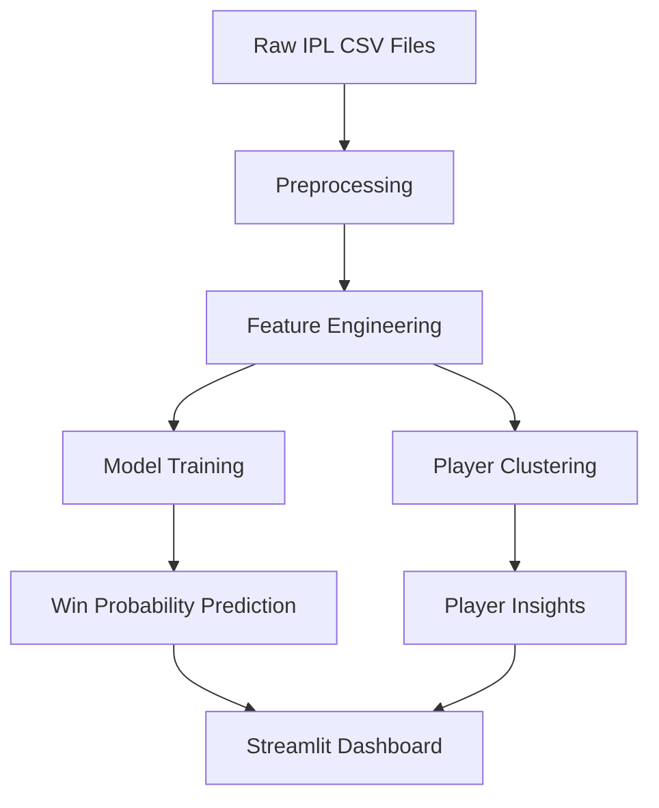
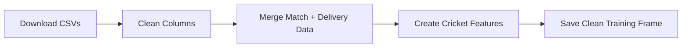
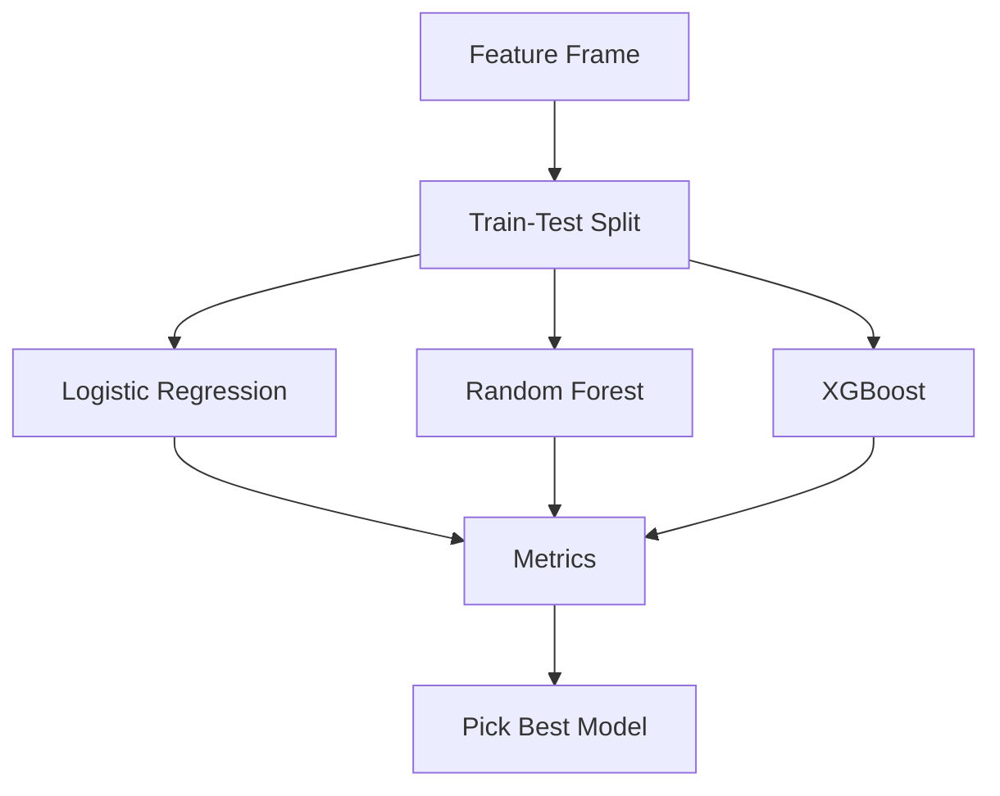
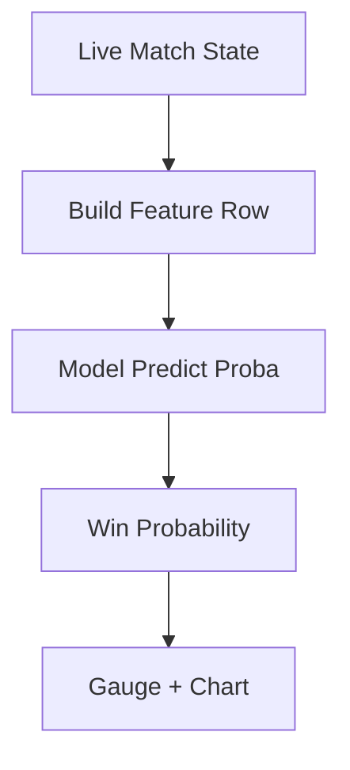
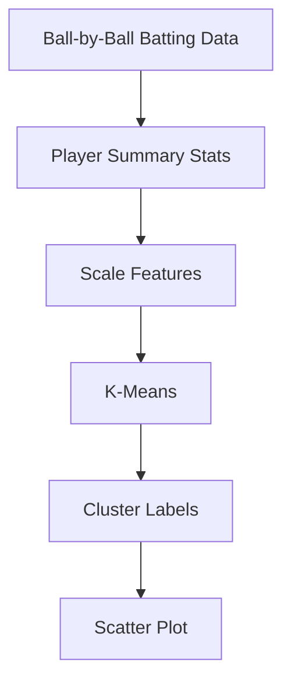
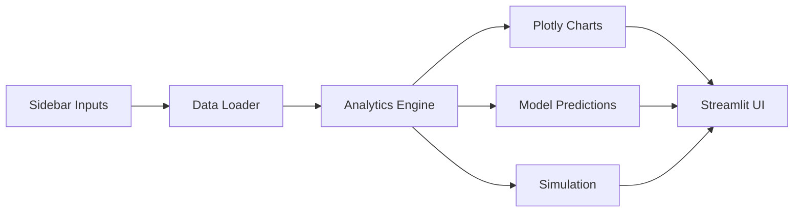
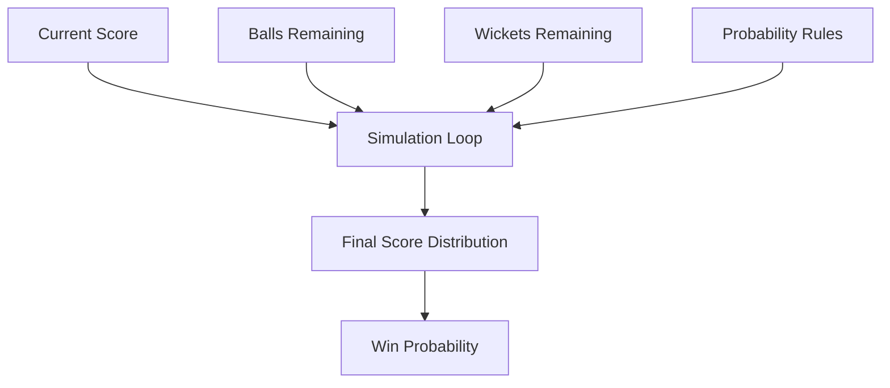

# IPL Analytics Engine - Predictive Modeling for Cricket

An end-to-end, beginner-friendly cricket analytics project that turns IPL ball-by-ball data into live win probability, player clusters, match simulations, and interactive dashboards.

**[Live Demo: https://ipl--analytics-engine-fms3rcmp9ednznew6dlh42.streamlit.app/](https://ipl--analytics-engine-fms3rcmp9ednznew6dlh42.streamlit.app/)**

This project is designed to be:

- Lightweight on CPU and RAM
- Easy to understand for beginners
- Professional enough for a resume and GitHub portfolio
- Modular, so each part can be improved later

## What This Project Does

- Analyzes IPL ball-by-ball data
- Builds cricket features like run rate, required run rate, wickets remaining, and pressure index
- Trains machine learning models to predict live win probability
- Compares Logistic Regression, Random Forest, and XGBoost
- Groups players into batting styles using K-Means clustering
- Simulates match situations with Monte Carlo logic
- Shows everything in a Streamlit dashboard with Plotly charts

## Why This Project Is Good for a Laptop Like Yours

Your laptop is powerful, but summer heat matters. This project keeps things efficient by using:

- Pandas vectorized operations instead of slow loops
- Lightweight tabular models instead of deep learning
- Streamlit caching for data and model reuse
- Smaller model sizes and controlled simulation counts
- Preprocessed features so the dashboard stays smooth

## Folder Structure

```text
project/
├── app.py
├── requirements.txt
├── data/
├── models/
├── notebooks/
├── assets/
├── utils/
│   ├── preprocessing.py
│   ├── feature_engineering.py
│   ├── model_training.py
│   ├── prediction.py
│   ├── clustering.py
│   ├── visualization.py
│   └── simulation.py
```

### Why each file exists

- `app.py`: Streamlit dashboard entry point
- `requirements.txt`: Python packages needed to run the project
- `data/`: Raw IPL CSV files or cleaned datasets
- `models/`: Saved machine learning models
- `notebooks/`: EDA and experimentation notebooks
- `assets/`: Images, diagrams, screenshots, and branding
- `models/ipl_win_model.joblib`: Saved trained model bundle created from the Streamlit app
- `utils/preprocessing.py`: Load data, clean column names, and build demo data
- `utils/feature_engineering.py`: Create cricket features for prediction
- `utils/model_training.py`: Train and evaluate ML models
- `utils/prediction.py`: Predict win probability from live match state
- `utils/clustering.py`: Player clustering logic
- `utils/visualization.py`: Plotly chart builders
- `utils/simulation.py`: Match simulation engine

## Where to Download IPL Data

Use public cricket datasets from sources like Kaggle.

Typical files you will find:

- `matches.csv`
- `deliveries.csv`

Search for datasets with phrases like:

- IPL ball-by-ball data
- IPL matches and deliveries
- Indian Premier League historical data

## How Cricket Datasets Are Structured

Usually, IPL datasets come in two levels:

### 1. Match-level data

One row per match.

Common columns:

- `id`
- `date`
- `venue`
- `team1`
- `team2`
- `winner`
- `result`
- `target`

### 2. Ball-by-ball data

One row per delivery.

Common columns:

- `match_id`
- `inning`
- `batting_team`
- `bowling_team`
- `over`
- `ball`
- `batsman`
- `non_striker`
- `bowler`
- `batsman_runs`
- `extra_runs`
- `total_runs`
- `wide_runs`
- `noball_runs`
- `player_dismissed`
- `dismissal_kind`

## What Each Important Column Means

- `match_id`: Which match the ball belongs to
- `inning`: 1st innings or 2nd innings
- `batting_team`: Team currently batting
- `bowling_team`: Team currently bowling
- `over`: Over number
- `ball`: Ball number inside the over
- `batsman_runs`: Runs scored by the batter off the bat
- `extra_runs`: Extra runs like wides or no-balls
- `total_runs`: Total runs from the delivery
- `player_dismissed`: Batter who got out on that ball
- `dismissal_kind`: How the batter got out


## Feature Engineering Ideas

These are the main cricket features used in the project:

- Current Run Rate
- Required Run Rate
- Wickets Remaining
- Balls Remaining
- Pressure Index
- Venue Advantage
- Batter Strike Rate
- Bowler Economy
- Recent Over Momentum
- Partnership Strength

### Why these features matter

- Current Run Rate: tells how fast the batting side is scoring
- Required Run Rate: tells how hard the chase is becoming
- Wickets Remaining: fewer wickets means less risk-taking freedom
- Balls Remaining: time pressure changes the whole chase
- Pressure Index: combines chase difficulty into one number
- Venue Advantage: some grounds are easier to chase on
- Batter Strike Rate: tells whether the batter scores fast
- Bowler Economy: tells whether the bowler is expensive or tight
- Recent Over Momentum: cricket changes quickly; recent form matters
- Partnership Strength: set batters often stabilize the chase

## Model Training Strategy

The project compares:

- Logistic Regression
- Random Forest
- XGBoost

### Which model usually works best?

XGBoost often performs best on tabular cricket data because:

- It learns complex patterns
- It handles non-linear relationships well
- It works strongly on structured data

### Why still keep Logistic Regression and Random Forest?

- Logistic Regression is simple and explainable
- Random Forest is a strong baseline
- Comparison makes the project look complete and professional

## Visualization Guide

The dashboard uses Plotly charts because they are interactive and smooth.

### Charts included

- Run progression graph
- Manhattan chart
- Worm chart
- Win probability graph
- Player comparison chart
- Venue heatmap
- Cluster scatter plot

### Simple meaning of each chart

- Run progression: how the score grows ball by ball
- Manhattan chart: runs scored on each ball
- Worm chart: score growth by over
- Win probability: chance of winning as the match moves forward
- Player comparison: compare batter styles side by side
- Venue heatmap: see which teams score well at which grounds
- Cluster scatter plot: see how batters group together

## Match Simulation Engine

The simulation engine asks:

- How many runs are needed?
- How many balls are left?
- How many wickets are left?
- How much pressure is on the batting team?

Then it runs many small simulated endings of the match.

### Internal logic in simple words

1. Start from the current match state
2. Randomly pick likely ball outcomes based on cricket probabilities
3. Update score and wickets
4. Repeat until the chase ends
5. Count how many simulations end in a win

This gives a realistic probability and also an expected final score range.

## Performance Optimization Rules Used Here

- Use `@st.cache_data` for data loading and feature prep
- Use `@st.cache_resource` for model reuse
- Avoid deep learning
- Use small tree-based models
- Keep simulations capped to a reasonable count
- Use vectorized Pandas operations
- Precompute features before dashboard rendering

## Streamlit Dashboard Sections

- Overview: basic stats and charts
- Win Probability: ball-by-ball live probability curve
- Player Clusters: batting style groups
- Simulation: what-if match scenarios
- Data Guide: what the cricket columns mean

## UI and Style Notes

The app uses a dark cricket analytics style with IPL-like gold accents.

Main UI features:

- Sidebar filters
- Dropdowns
- Sliders
- Probability gauge
- Responsive layout
- Interactive charts

## Deployment Guide

### Streamlit Cloud

1. Push the project to GitHub
2. Make sure `requirements.txt` is present
3. Open Streamlit Cloud
4. Choose the repository and the `app.py` file
5. Deploy

### Hugging Face Spaces

1. Create a new Streamlit Space
2. Connect the GitHub repository or upload files
3. Add `requirements.txt`
4. Deploy the Space

### Saved Model Workflow

- Train the model once inside the app.
- Click `Save trained model` in the sidebar.
- The bundle is saved to `models/ipl_win_model.joblib`.
- On the next launch, the app reuses the saved model automatically.

**Note:** A training run was completed locally and the best model (`logistic_regression`) was saved to `models/ipl_win_model.joblib`.
Recent leaderboard (example): `logistic_regression` ROC-AUC ~ 0.807, `random_forest` ROC-AUC ~ 0.792, `xgboost` ROC-AUC ~ 0.781.

### Environment Variables

If you later add API keys for live scores:

- Store them in `st.secrets` on Streamlit Cloud
- Do not hardcode them in the source files

## Architecture Diagrams

### 1. System Architecture



### 2. Data Pipeline



### 3. ML Pipeline



### 4. Prediction Workflow



### 5. Clustering Workflow



### 6. Dashboard Architecture



### 7. Match Simulation Workflow



## ASCII Overview

```text
Raw IPL data -> Clean data -> Cricket features -> ML model -> Probability dashboard
                         \-> Player clustering -> Batting style insights
                         \-> Monte Carlo simulation -> Match scenario answers
```

## Screenshots To Add Later

Place these files inside `assets/` when you capture them:

- `dashboard-overview.png`
- `win-probability.png`
- `player-clusters.png`
- `match-simulation.png`


## Future Improvements

- Connect live IPL score APIs
- Add player recommendation systems
- Add fantasy cricket prediction
- Add commentary sentiment analysis
- Add animated probability transitions
- Add stronger model calibration methods

## How to Run Locally

1. Install dependencies
2. Put `matches.csv` and `deliveries.csv` in `data/`
3. Run the Streamlit app

Example:

```bash
streamlit run app.py
```

